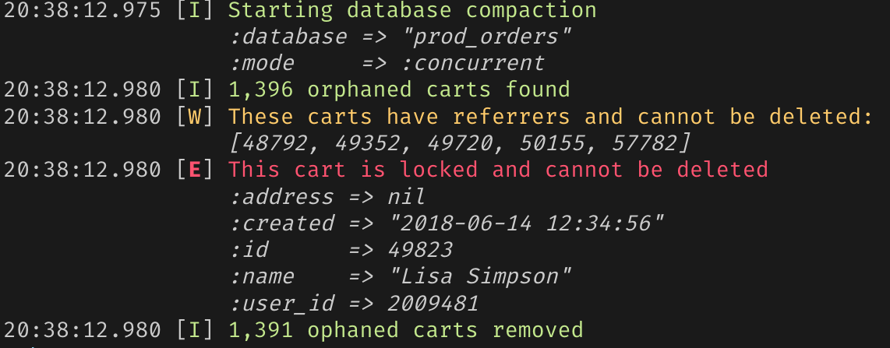

# Bunyan: An Elixir Logger

* easily extended with additional data sources and writers

* can be networked (with one or more nodes also collecting messages from
  other nodes)

* should be performant, as it
  * bypasses the implicit serialization of the event based approach,
  * uses broadcasts where a appriopriate, and
  * uses iolists to construct messages

* humane formatting of multi-line messages (including error_logger and
  SASL)

* supports per-source and per-writer configuration, and the ability to
  log to multiple files and devices

* works with logrotate (send it a `SIGHUP` and it will close and reopen
  the log file).

> #### Note
>  This is the omnibus version of Bunyan, which includes the API, Erlang
error logger, and remote logging plugins, along with the writers for
consoles, files, and remote nodes. If you want to configure a more
minimal installation, have a look at [Bunyan
Core](https://github.com/bunyan-logger/bunyan_core).

## Show Me!

Here's some code that writes log messages. Obviously, in real code the
values wouldn't be hardcoded...

~~~ elixir
require Bunyan
import Bunyan

info("Starting database compaction", %{
  database: "prod_orders",
  mode:     :concurrent
})

# ...

info("1,396 orphaned carts found")

# ...

warn("These carts have referrers and cannot be deleted:",
     [ 48792, 49352, 49720, 50155, 57782 ])

# ...
error("This cart is locked and cannot be deleted",
      %{
        id: 49823,
        user_id: 2009481,
        created: "2018-06-14 12:34:56",
        name: "Lisa Simpson",
        address: nil
    })

info("1,391 ophaned carts removed")
~~~

And here's the result if you've configured Bunyan to log to a console
with ANSI color support.

## Try It

There's a simple demo of networked, hierarchical logging at
https://github.com/bunyan-logger/demo-remote-logging.

## Summary

### Summary of the Summary

~~~ elixir
{ :bunyan, ">= 0.0.0" }
~~~

Basic logging:

~~~ elixir
require Bunyan

Bunyan.info "message or function"
Bunyan.info "message or function", «extra»
~~~

Message can have embedded newlines, which will be honored. `«extra»` can
be any Elixir term: maps are encouraged, as they are formatted nicely.

### API Overview

#### Logging Functions

You must `require Bunyan` before using any of these four functions.

* `Bunyan.debug(msg_or_fun, extra \\ nil)`
* `Bunyan.info(msg_or_fun,  extra \\ nil)`
* `Bunyan.warn(msg_or_fun,  extra \\ nil)`
* `Bunyan.error(msg_or_fun, extra \\ nil)`

If the first parameter is a function, it will only be invoked if the
source log level is at or below the level of the message being
generated.

The second parameter is optional Elixir term. It will be displayed
beneath the main text of the message. If it is a map, it will be shown
in a tabular structure.

#### Runtime Configuration

* tba

## Architecture

         SOURCES                    CORE                     WRITERS
         ‾‾‾‾‾‾‾                    ‾‾‾‾                     ‾‾‾‾‾‾‾
    ╭──────────────╮                                    ╭────────────────╮
    │ Programmatic │ \                             ---->│ Write to stdout│
    │     API      │  \                           /     │ files, etc     │
    ╰──────────────╯   \                         /      ╰────────────────╯
                        \                       /
    ╭──────────────╮     ----> ╭──────────────╮/        ╭────────────────╮
    │ Erlang error │ ╌╌╌╌╌╌╌╌> │ Collect &    │╌╌╌╌╌╌╌> │   Write to     │
    │   logger     │     ----> │ distribute   │\        │  remote node   │
    ╰──────────────╯    /      ╰──────────────╯ \       ╰────────────────╯
                       /                         \
    ╭──────────────╮  /                           \     ╭────────────────╮
    │    Remote    │ /                             \    │     etc        │
    │    reader    │                                --->│                |
    ╰──────────────╯                                    ╰────────────────╯

Bunyan takes logging input from a variety of sources. It is distributed
with three:

* an API which provides the functions you can call in your application,
* an Erlang error handler which intercepts, reformats, and injects
  Erlang and OTP errors, and
* a source that can accept log messages from other instances of this
  logger (which we call remote logging)

These sources are all plugins: you have to add them as dependencies (or
use the batteries-included hex package) if you want to use them.

The sources send log messages to the collector. This in turn forwards
the messages to the various log writers. Two writers come as standard:

* one writes to standard error (or a file on disk);
* the other writes to a remote instance of Bunyan.

Again, these are both optional.

You can configure multiple instances of each type of writer. This would
allow you to (for example) log everything to standard error, errors only
to a log file, and warnings and errors to two separate remote loggers.

You can easily add new sources and new writers to Bunyan.

### Components

Bunyan is organized as a core module, `bunyan_core`, and a set of
plugins. If you just use this project (`bunyan`) as a dependency, you'll
automatically get them all.

Alternatively, you can use `bunyan_core` as a dependency, and then add
just the plugins that you want to use. You only have to add a plugin as
a dependency if you declare it in the configuration (see below).

The various components are:

| Name              | Function |
| ------------------|----------|
| [bunyan_core](https://github.com/bunyan-logger/bunyan_core) | The _Collector_ component, which distributes incoming messages to writers |
| [bunyan_source_api](https://github.com/bunyan-logger/bunyan_source_api) | Provides the API to the logger (the stuff called by your application) |
| [buyan_source_erlang_error_logger](https://github.com/bunyan-logger/buyan_source_erlang_error_logger) | Injects Erlang, OTP, and SASL errors |
| [bunyan_source_remote_reader](https://github.com/bunyan-logger/bunyan_source_remote_reader) | Injects log messages sent from a remote node |
| [bunyan_writer_device](https://github.com/bunyan-logger/bunyan_writer_device) | Write messages to a console, file, or other device. |
| [bunyan_writer_remote](https://github.com/bunyan-logger/bunyan_writer_remote) | Write messages to a remote node |

There are two additional components,
[bunyan_shared](https://github.com/bunyan-logger/bunyan_shared) and
[bunyan_formatter](https://github.com/bunyan-logger/bunyan_formatter), that are
used by the plugins. You do not need to declare these as dependencies.

## Log Levels

The log levels are `debug`, `info`, `warn`, and `error`, with `debug`
being the lowest and `error` the highest.

You can set log levels indpendently for each of the sources and each of
the writers.

The level set on a source determines which messages are sent on to the
writters. The level set on a writer determines which messages get
written.

In addition, the API source has an additional option to set the compile
time log level. Calls to logging functions will not be compiled into
your code if they are below this level.

## Configuration

Configuration can be specified in the regular `config.xxx` files. Much
of it can also be set at runtime using the `Bunyan.config` function.

The top level configuration looks like this:

~~~ elixir
[
  read_from: [
    «list of sources»
  ],
  write_to: [
    «list of writers»
  ]
]
~~~

* `read_from:`

   A list of sources (see below).

* `write_to:`

   A list of writers (also below).

### Source Configuration

Each source configuration entry can be either a module name, or a tuple
containing a module name and a keyword list of options:

`Bunyan.Source.API` _or_
`{ Bunyan.Source.API, compile_time_log_level: :info }`

Each source module has its own set of configuration options.

#### Source: `Bunyan.Source.API`

Provides a programmatic API that lets applications create log messages
and configure the logger.

Options:

* `runtime_log_level:` _:debug_, _:info_, _:warn_, or _:error_

   Only calls to the corresponding API functions at or above this level
   will be passed to the collector.

   Defaults to `:debug` in development, `:info` otherwise.

* `compile_time_log_level:` _:debug_, _:info_, _:warn_, or _:error_

   Calls to the corresponding API functions below this this level
   will be ignored: no code will be generated for them. Because of this,
   you don't want to give function calls with side effects as parameters
   to logging functions.

   Defaults to `:debug` in development, `:info` otherwise.

#### Source: `Bunyan.Source.ErlangErrorLogger`

Handles messages and reports generated by the Erlang `error_logger`. It
also handles SASL and OTP messages that the error logger forwards.

* `runtime_log_level:` _:debug_, _:info_, _:warn_, or _:error_

   Only calls to the corresponding API functions at or above this level
   will be passed to the collector.

   Defaults to `:debug` in development, `:info` otherwise.

### Writer Configuration

Bunyan comes with two writers (but you can add your own—see below).

#### Writer: `Bunyan.Writer.Device`

Writes log messages to standard error after formatting them for human
consumption.

* `name:`

   The OTP name associated with this device. Set this if you want to run
   multiple device writers, as each must have a distinct name. You'll
   also need to specify this if you want to set device-specific options
   in your code (as the name is used to identify which device to
   update).

* `device:`

   This writer will send messages to the specified device. This is
   either the name of an IO handler (such as `:user` or
   `:standard_error`) or a string containing a file name. It would be
   produce to make this filename an absolue path.

   Defaults to `:user`

* `pid_file_name:`

   If the log device is a file on disk, and if this option is set to the
   name of a pid file, the operating system pid (not the Erland pid) of
   the writer will be stored in the pid file. This allows utilities such
   as [logrotate][1] to send a USR1 signal to the writer, which will
   cause the writer to close and reopen the log file.

* `runtime_log_level:` _:debug_, _:info_, _:warn_, or _:error_

   Only calls to the corresponding API functions at or above this level
   will be written to standard error.

   Defaults to `:debug` in development, `:info` otherwise.

* `main_format_string:`

   The format used for the first line of a log message (see Formats
   below)

   Defaults to `"$time [$level] $message_first_line"`

* `additional_format_string:`

   The format used on the remaining lines of the log message.

   Defaults to `"$message_rest\n$extra"`.

* `level_colors: %{ ... }`

   Specifies the colors to be used when displaying the `$level` field.
   This is a map of one or more entries where the keys are the log level
   and the value is a string used to prefix that level. You can use
   `IO.ANSI` to generate these strings.

   The defaults are:

   ~~~ elixir
   level_colors:   %{
     @debug => faint(),
     @info  => green(),
     @warn  => yellow(),
     @error => light_red() <> bright()
   }
   ~~~

* `message_colors:`

  The colors used for the message text at various log levels.

  ~~~ elixir
  message_colors: %{
    @debug => faint(),
    @info  => reset(),
    @warn  => yellow(),
    @error => light_red()
  }
  ~~~

* `timestamp_color:`

  The attributes used to display the `$time`, `$date`, and `$datetime`
  fields. Defaults to `faint()`.

* `extra_color:`

  The attributes used to display the `$extra` field. Defaults to `italic()<>faint()`.

* `use_ansi_color?:`

  If falsy, the various color attributes will be ignored, and the log
  messages will not be colored.

  Defaults to `true` if writing to a console, `false` otherwise.

#### Writer:  Bunyan.Writer.Remote

    :send_to,         # name of the remote logger process
    :send_to_node,    # the node or nodes when the remote reader lives. If nil, send to all
    :send_to_nodes,   # alias for `send_to_node`
    :min_log_level,   # only send >= this,
    :name,

Used to forward log messages to another instance of Bunyan.

* `runtime_log_level:` _:debug_, _:info_, _:warn_, or _:error_

   Only log messages at or above this level will be forwarded to the
   remote logger.

   Defaults to `:warn`.

* `send_to:`

  The name of the logger to send the log messages to. This name must
  have been given as an `accept_remote_as` option to that logger.

* `send_to_node:`  or `send_to_nodes:`

  The name of a node, or a list of nodes. If specified, log messages
  will be forwarded to the loggers on these nodes (connecting to the
  nodes first if required). If not specified, the log message will be
  broadcast to all connected nodes, and any log reader using the given
  name will receive it.

* `max_pending_size:` and `max_pending_wait:`

  The remote logger tries to cut down on network traffic by batching
  messages before forwarding them. Once it receives the first message in
  a batch, it will then start a timer for `max_pending_wait:`
  milliseconds (default 200). When this timer expires, or when
  `max_pending_size` (default 100) messages are pending, all the
  messages will be sent, and the batching process reinitiated.

### Log Message Format Specifications

The `Device` writer tries to create nicely formatted output. For
example, it will try to indent multi-line messages so the start of the
text of the message lines up, and it recognizes things such as maps when
laying out nontext data.

What it writes is under your control. You specify this using format
strings. Each message is potentially formatted using two formats. The
first of these, the `main_format_string` is used to write the first line
of the message. Typically this string will include some kind of time
stamp and a log level, as well as the first line of the actual log
message.

The `additional_format_string` is used to format the rest of the log
message (if any). The output generated under the control of this format
will automatically be indented to line up with the start of the message
in the first line.

Newlines in the message or in the format string will automatically cause
the message to be split and indented.

A format string consists of regular text and field names. The regular
text is simply copied into the resulting message. The contents of the
corresponding fields are substituted for the field names.

* `$date`

   The date the log message was sent (yy-mm-dd).

* `$time`

   The time the log message was sent (hh:mm:ss.mmm). because we'll all big
   girls and boys, this time will be in UTC.

* `$datetime`

   `"$date $time"`

* `$message`

   The whole log message. If the message contains newlines, it will be
   split, with the second and subsequent lines appearing beneath the
   first and left-aligned with it.

* `$msg_first_line`

   Just the first line of the message

* `$msg_rest`

   Lines 2... of the message

* `$level`

   The log level as a single character (D, I, W, or E)

* `$node`

   The node that generated the message

* `$pid`

   The pid that generated the message

* `$remote_info`

   A combination of the pid and node, with a trailing newline. If a log
   message originates from the same node that the logger is running on,
   nothing will be generated.

* `$extra`

   For messages generated via the API, this will be the contents of the
   second parameter, formatted nicely.

   For reports coming from the Erlang error logger, this will be the
   raw content of the report.

### A Sample Configuration

This is probably _way_ more than you'd ever need to specify, but I
wanted to show all the options:

~~~ elixir
[
  read_from:              [
    Bunyan.Source.Api,
    Bunyan.Source.ErlangErrorLogger,
  ],
  write_to:               [
    {
      Bunyan.Writer.Device, [
        name:  :stdout_logging,

        main_format_string:        "$time [$level] $remote_info$message_first_line",
        additional_format_string:  "$message_rest\n$extra",

        level_colors:   %{
          @debug => faint(),
          @info  => green(),
          @warn  => yellow(),
          @error => light_red() <> bright(),
        },
        message_colors: %{
          @debug => faint(),
          @info  => reset(),
          @warn  => yellow(),
          @error => light_red(),
        },
        timestamp_color: faint(),
        extra_color:     italic() <> faint(),

        use_ansi_color?: true
      ]
    },
    {
      Bunyan.Writer.Device, [
        name:  :critical_errors,
        device:            "/var/log/myapp_errors.log",
        pid_file_name:     "/var/run/myapp.pid",
        rumtime_log_level: :error,
        use_ansi_color?:   false,
      ]
    },
    {
       Bunyan.Writer.Remote, [

          # assumes there's a Bunyan.Source.GlobalReader with
          # `global_name: MyApp.GlobalLogger` running on
          # the given two nodes

          send_to: MyApp.GlobalLogger,
          send_to_nodes:  [
            :"main_logger@192.168.1.2",
            :"backup_logger@192.68.1.2",
          ],
          runtime_log_level: :warn,
      ]
    },
  ]
]
~~~

## To Do

- [ ] Runtime configuration (hooks are in place)
- [ ] Guides for creating your own sources and writers
- [ ] Finish off reformatting of Erlang error logger and sasl messages
      (framework in place)
- [ ] Add support for OTP 21 `:logger`

## Why Another Logger?

I needed a distributed logger as part of the Toyland project, and
couldn't find what I needed. I also wanted to experiment with something
more decoupled than the available options.

## A Big, Big Thank You!

To Benjamin Coppock, who let me take over the project name Bunyan on
Hex. His original project is still available as

    { bunyan: "0.1.0" }

[1]: https://linux.die.net/man/8/logrotate